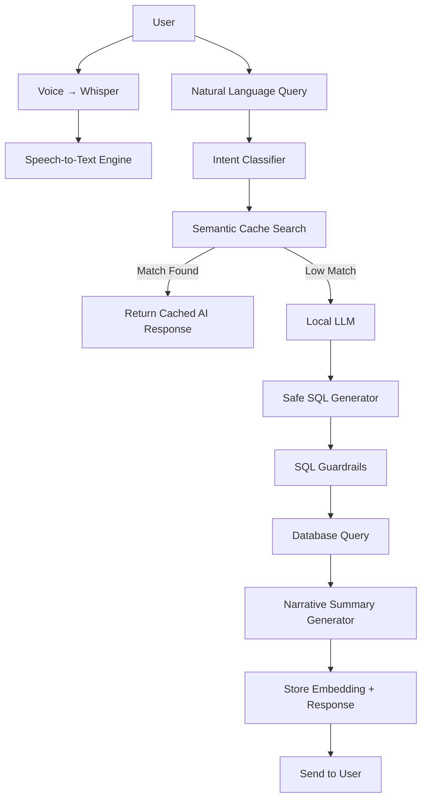

# ExpenseApp AI System Documentation  
Advanced AI + Embedding + Voice Architecture

## 1. Overview
ExpenseApp includes a full **on-device AI architecture** that provides:
- Natural language querying  
- Safe SQL generation  
- Semantic memory (vector search)  
- Whisper-based voice recognition  
- Transaction auto-categorization  

The AI system is designed to be:
- **Modular**
- **Offline-capable**
- **Secure**
- **Extendable** (RAG, agents, workflows)

---

## 2. High-Level Architecture



---

## 3. Modules

### **3.1 Intent Classification Layer**
Identifies:
- Transaction summary queries  
- Budget analytics  
- Category-level insights  
- Aggregations (“total”, “highest”, “average”)  
- Time ranges (Y/Q/M)

Techniques:
- Keyword rules  
- LLM-based disambiguation  
- Time parser  

---

### **3.2 Safe SQL Generator**
Steps:
1. Extract structured query requirements  
2. Generate SELECT-only SQL  
3. Validate SQL using guardrails:
   - No `UPDATE`, `DELETE`, `INSERT`
   - Only whitelisted tables  
   - Limited joins  
4. Execute via repository layer

---

### **3.3 Embedding System**
- Uses **pgvector** (768 dim)  
- Every user query stored as embedding + response  
- ANN search via HNSW index  

Hit conditions:
```
cosine_distance < 0.15 → Reuse cached result
```

---

### **3.4 LLM Integration**
Default:
- **Ollama models** (Llama 3 / Qwen 2.5 / Mistral)

Used for:
- SQL generation  
- Summaries  
- Auto categorization  

---

### **3.5 Voice System (Whisper)**
Supports:
- Hindi  
- English  
- Marathi  

Flow:
```
microphone → .wav → Whisper.cpp → text → AI pipeline
```

---

### **3.6 Auto Categorizer**
Model input:
- Transaction description  
- Merchant  
- Amount  

Output:
- Predicted category  
- Confidence value  

Fallback:
- Category = “Uncategorized” if confidence < threshold

---

## 4. Extensibility

### Future Additions:
- Multi-hop LLM agents  
- Financial RAG (bank PDFs → embeddings)  
- Invoice OCR ingestion  
- Smart budgets  
- Personalized recommendations  

---

## 5. Debugging AI

### Check embeddings:
```
SELECT * FROM embedding_cache ORDER BY created_at DESC;
```

### Log SQL generation:
Enable debug mode in:
```
APP_AI_DEBUG=true
```

### Whisper troubleshooting:
- Verify model path  
- Test using: `whisper-cli test.wav`

---

# End of README_AI.md
