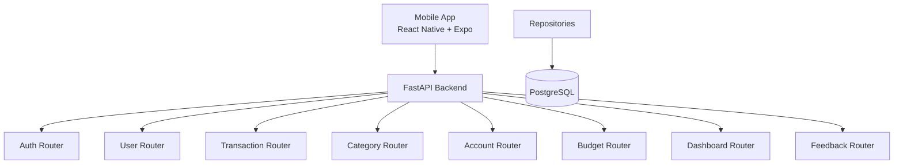

# 📘 ExpenseApp Backend API

**FastAPI · PostgreSQL**

Enterprise-grade backend powering the ExpenseApp mobile application with secure APIs, financial workflows, and analytics.

---

## 1. 📌 Overview

The **ExpenseApp Backend** is a **modular, async FastAPI service** built to support a mobile-first application using **React Native (Expo)**.

It provides:

* 🔐 Secure authentication (JWT)
* 💼 Core financial management APIs
* 📊 Aggregated dashboard & analytics APIs
* ⚡ High-performance async processing

---

## 2. 🏗️ Architectural Principles

* **Async-first** → FastAPI + SQLAlchemy Async
* **Layered architecture**

```
Routers → Services → Repositories → Database
```

* **Mobile-first API design**

  * Lightweight payloads
  * Predictable responses
  * Aggregated endpoints for fewer API calls

---

## 3. 🔷 High-Level Architecture



---

## 4. 📁 Folder Structure

```
backend-api/
└─ app/
   ├─ core/             # Configs (DB, security, settings)
   ├─ middlewares/      # Auth, CORS, exception handling
   ├─ models/           # SQLAlchemy models
   ├─ repositories/     # Data access layer
   ├─ routers/          # API endpoints
   ├─ schemas/          # Request/response models
   ├─ seed/             # Data seeding utilities
   ├─ services/         # Business logic
   ├─ utils/            # Helpers & constants
   └─ main.py           # Entry point
```

---

## 5. 🔐 Authentication & Security

### Mechanism

* JWT-based authentication
* OAuth2 password flow

### Header Format

```
Authorization: Bearer <token>
```

### Endpoints

```
POST   /auth/register
POST   /auth/login
GET    /auth/me
PUT    /auth/{user_id}
```

### Mobile Flow

1. Login → Receive JWT
2. Store securely (SecureStore / Keychain)
3. Attach token in all requests
4. Use `/auth/me` for session restoration

---

## 6. 📊 Core Business APIs

### 👤 Users

```
POST   /users
GET    /users
GET    /users/{user_id}
PUT    /users/{user_id}
DELETE /users/{user_id}

GET    /users/searchByEmail
GET    /users/searchByPhone
```

---

### 🏦 Accounts

```
GET    /accounts
GET    /accounts/{account_id}
POST   /accounts
PUT    /accounts/{account_id}
DELETE /accounts/{account_id}
```

---

### 🗂️ Categories

```
GET    /categories
GET    /categories/{category_id}
POST   /categories
PUT    /categories/{category_id}
DELETE /categories/{category_id}
```

---

### 💸 Transactions

```
GET    /transactions
GET    /transactions/{transaction_id}
POST   /transactions
PUT    /transactions/{transaction_id}
DELETE /transactions/{transaction_id}

GET    /transactions/grouped-by-category
GET    /transactions/summary-by-category
```

---

### 🎯 Budgets

```
GET    /budgets
GET    /budgets/{budget_id}
GET    /budgets/by-month
GET    /budgets/total-amount

POST   /budgets/create-all-budgets
POST   /budgets/save-all-budgets
```

---

### 📈 Dashboard (Aggregated APIs)

```
GET /dashboard/summary
GET /dashboard/categories
GET /dashboard/recent
GET /dashboard/accounts
```

✔ Reduces API calls
✔ Improves mobile performance
✔ Pre-computed analytics

---

### 💬 Feedback

```
GET    /feedback
GET    /feedback/{feedback_id}
POST   /feedback
PUT    /feedback/{feedback_id}
DELETE /feedback/{feedback_id}
```

---

Here’s the **refined addition to your `README.API.md`** with a **sanitized `.env` example**, best practices, and proper placement under configuration.

---

## 7. ⚙️ Environment Variables

Create a `.env` file in the `backend-api` root directory.

### 📄 Sample `.env` (Development)

> ⚠️ **Important:** Never commit real credentials or secrets to version control.

```env
# Application
APP_NAME=ExpenseApp

# Database Configuration
DB_HOST=localhost
DB_PORT=5432
DB_NAME=expensedb
DB_USER=postgres
DB_PASSWORD=your_password_here

# Security
SECRET_KEY=your_secret_key_here_change_this
ALGORITHM=HS256
ACCESS_TOKEN_EXPIRE_MINUTES=30
```

---

## 8. 🚀 Running Locally

```bash
uvicorn app.main:app --host 0.0.0.0 --port 80 --reload
```

Swagger UI:

```
http://localhost/docs
```

---

## 9. 🗄️ Database Backup & Restore

### Restore `.sql`

```bash
docker exec -i expense_pg psql -U postgres -d expensedb < expensedb_backup.sql
```

---

### Restore `.backup`

```bash
docker exec -i expense_pg pg_restore -U postgres -d expensedb < expensedb.backup
```

---

### Ensure Extensions

```bash
docker exec -i expense_pg \
psql -U postgres -d expensedb -c "CREATE EXTENSION IF NOT EXISTS vector;"
```

---

## 10. 🔄 Migrating Sample Data from Existing Application

This section explains how to migrate **real or sample data from an existing ExpenseApp or legacy system** into this backend.

---

### 🔹 Option 1: Direct Database Migration (Recommended)

#### Step 1: Export from Existing DB

```bash
pg_dump -U postgres -d old_expensedb -f expensedb_backup.sql
```

---

#### Step 2: Clean / Validate Dump

* Ensure tables match new schema
* Remove:

  * Deprecated columns
  * Unsupported constraints
* Verify:

  * `users`, `accounts`, `categories`, `transactions`, `budgets`

---

#### Step 3: Import into New DB

```bash
docker exec -i expense_pg psql -U postgres -d expensedb < expensedb_backup.sql
```

---

#### Step 4: Post-Migration Fixes

* Reset sequences:

```sql
SELECT setval(pg_get_serial_sequence('users','id'), MAX(id)) FROM users;
```

* Validate relationships:

  * User → Accounts
  * Accounts → Transactions
  * Categories → Transactions

---

### 🔹 Option 2: API-Based Migration (Safer, Schema-Friendly)

Use this when schemas differ.

#### Steps:

1. Export data as JSON from old system
2. Write migration script (Python / Node.js)
3. Insert via APIs:

Example:

```bash
POST /users
POST /accounts
POST /categories
POST /transactions
POST /budgets
```

✔ Ensures validation
✔ Applies business rules
✔ Avoids schema mismatch issues

---

### 🔹 Option 3: Seed-Based Migration (For Demo Data)

If using predefined datasets:

```bash
python -m app.seed.seed_data
```

You can:

* Modify seed scripts
* Inject real sample datasets
* Create demo-ready environments

---

### ⚠️ Migration Best Practices

* Always backup before migration
* Run migration on staging first
* Validate totals (income vs expenses)
* Check foreign key integrity
* Monitor API logs for failures

---

## 11. 🚀 Deployment Notes

* Stateless FastAPI containers
* PostgreSQL with proper indexing
* Gunicorn + Uvicorn workers
* Kubernetes-ready
* Horizontal scaling supported

---

## 12. 📱 Mobile Integration Tips

* Prefer **dashboard APIs** over multiple calls
* Cache master data (categories, accounts)
* Always pass `user_id` where required
* Handle token expiry gracefully

---

## ✅ Summary

The ExpenseApp Backend is:

* ⚡ **High-performance (async)**
* 📱 **Mobile-first optimized**
* ☁️ **Cloud & container ready**
* 🧩 **Modular and extensible**